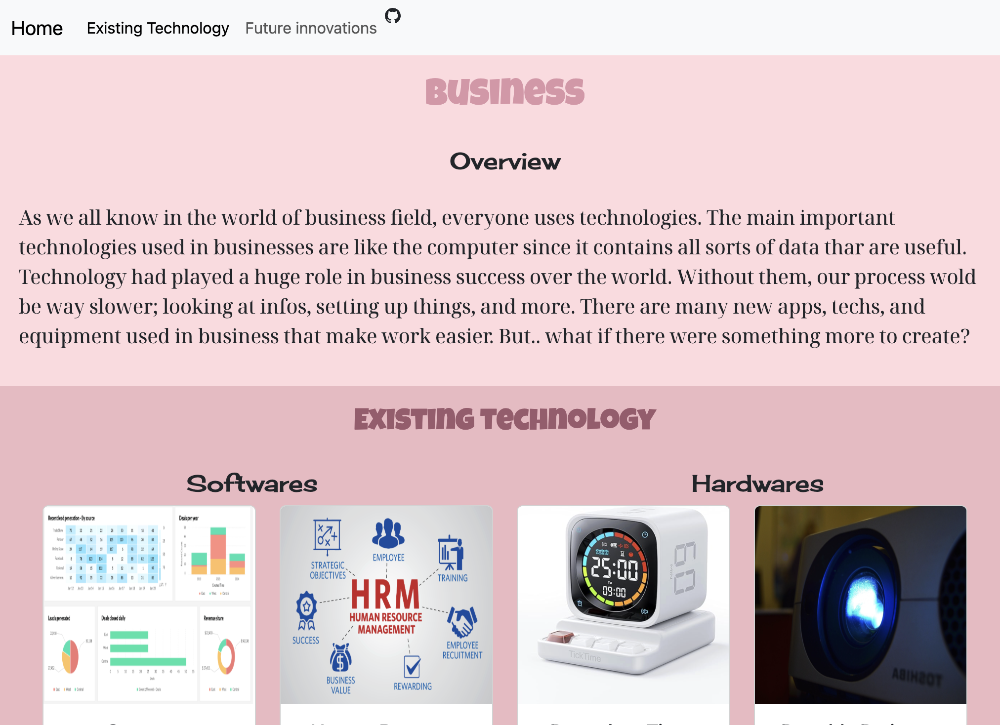

# Entry 6
##### 5/6

## Content
I worked with my partner Angelina to create a website for the freedom project using our knowledge of the tools we chosen and components we learned. The first thing we did was create [wireframes](https://wireframe.cc/2api2S) to plan how we want our website to look like. After that, we planed out the color scheme, fonts that we are going to be using, and created a timeline. While making our website, we discussed how we're going to write the overview and what technologies to add and write about. For the future innovation part, I used Aframe which is the tool to show viewers a visual of how it will look like. I designed a special type of usb that contains infinite storage.



For this project I got more familiar with Aframe and the components of cards. I also learned how to make many things responsive.

#### My tool
I used the tool [aframe](https://aframe.io/) to add to my freedom project. I created a usb using my imagination and knowledge of aframe. I created this usb by using a bunch of boxes. I changed the metalness and roughness to make it seem more detailes and also used a cylinder to create the ground where the usb lies on.
**Here is a preview of my code:**
``` bash
   <a-scene>
      <a-box position="-1 0.7 -3"
      color="#454545" depth="1" height="0.5" width="2.5"
      metalness= "1" roughness= "0.1">
    </a-box>
       <a-box position="-1 0.7 -3"
      color="#999999" depth="1.1" height="0.5" width="2.6"
      metalness= "1" opacity="0.4" roughness= "0.1" >
    </a-box>
          <a-box position="-1.9 0.7 -3"
      color="#999999" depth="0.7" height="0.4" width="1"metalness= "1" roughness= "0.1"></a-box>>
    </a-box>

     <a-box position="-2.55 0.7 -3"
      color="#707070" depth="0.65" height="0.2" width="0.7" metalness= "0" roughness= "0.1"></a-box>>
    </a-box>
      <a-box position="-2.559 0.7 -3"
      color="#000000" depth="0.5" height="0.15" width="0.7" metalness= "0" roughness= "0.1"></a-box>>
    </a-box>
    <a-box position="-2.56 0.69 -3"
      color="#2C3F57" depth="0.48" height="0.06" width="0.7" metalness= "0" roughness= "0.1"></a-box>>
    </a-box>
    <a-box position="-2.76 0.78 -2.85"
      color="#000000" depth="0.13" height="0.06" width="0.13" metalness= "0" roughness= "0.1"></a-box>>
    </a-box>
        <a-box position="-2.76 0.78 -3.175"
      color="#000000" depth="0.13" height="0.06" width="0.13" metalness= "0" roughness= "0.1"></a-box>>
    </a-box>

      <a-box position="-1 0.65 -3"
      color="#FF36F0" depth="1.05" height="0.05" width="2.55" roughness= "0">
    </a-box>

      <a-sky color="#ffffff"></a-sky>
 <a-cylinder id="ground" src="https://cdn.aframe.io/a-painter/images/floor.jpg" radius="32" height="0.1"></a-cylinder>
    </a-scene>
```

## Challenges
The most challenging part of creating this website was when me and my partner were trying to align the existing technology section correctly. It took us many tries to get it to align correctly. We wanted to align the cards for softwares on the left side and the cards for hardwares on the right side however, our problem was the hardware header wouldnt place on top on the right of softwares. It took us a long time to figure out the problem and with the help of mr mueller, we figured out that the problem was adding too many dividers and most importantly was missing rows and putting in the wrong column size. We used `col-md-4` instead of `col-md-6` which messed it up because they use up different width sizes and use different number of columns.
**Example:**
``` bash
<div class="container-fluid bg-1 text-center">
        <h2 id="Existing Technology">Existing technology</h2>
        <div class="row">
          <div class="col-md-6">
              <h4>Softwares</h4>
          </div>
          <div class="col-md-6">
            <h4>Hardwares </h4>
          </div>
      </div>

  <div class="container">
<div class="row">
```
## Engineering Design Process
Currently, I am almost finished with my freedom project. I have already reached my MVP as well as my beyond MVP. Now for my next steps, I will prepare for my presentation and maybe add little details to my aframe if I have time to.

## Skills
Skills that I gained while working on my freedom project is creativity, communication, and learning on my own.

#### Communication
Communication is a important skill that I was required to use when working on this project. I had to communicate to Angelina on how we would want the website to look like and work on something we both need to agree on. We also had to discuss what part both of us should work on instead of working on the same section to avoid merge conflicts and not waste time.
#### Creativity
When designing the website, I was required to think out of the box and figure out what colors goes best together to make the website look more appealing to viewers. I also had to look for fonts that would look nice and most importantly think of how to model my future innovation when working on the aframe.
#### How to learn
I had to learn on my own when learning my tool and adding my card components. I had to search up how to make primitives look more metalic and change the opacity and for the cards I had to figure out on my own on how to add images to the cards and texts. 


[Previous](entry05.md) | [Next](entry07.md)

[Home](../README.md)
